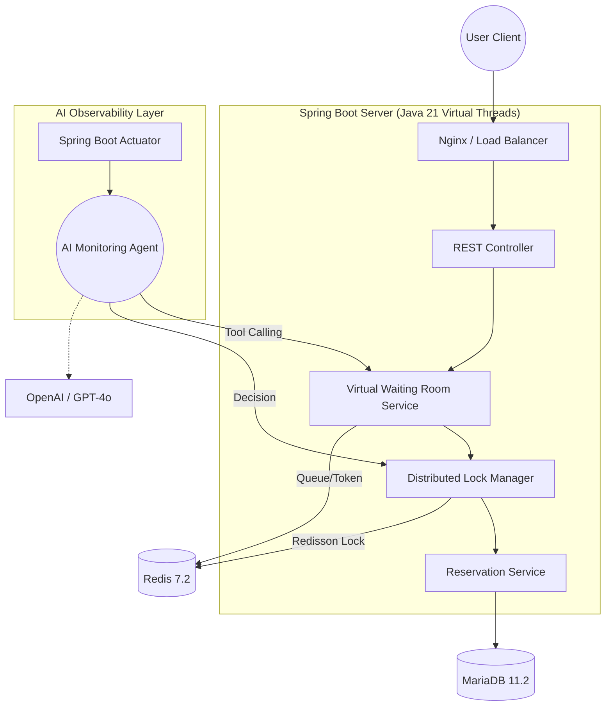

# 🎫 T-CORE v2
> **AI-Managed High-Traffic Ticketing Engine**
> 자율 운영 AI 에이전트를 결합한 고성능·고가용성 티켓팅 시스템

---

## 🚀 Project Vision
**"단순한 기능 구현을 넘어, 엔지니어링으로 대규모 트래픽의 한계를 극복합니다."**

T-CORE는 인기 콘서트 예매 시 발생하는 급격한 트래픽 폭주(Traffic Spike) 상황에서도 시스템의 안정성을 유지하고, 데이터 정합성을 100% 보장하는 것을 목표로 합니다. 특히, 현대적인 **AIOps** 개념을 도입하여 AI 에이전트가 실시간으로 시스템을 모니터링하고 장애에 자율적으로 대응하는 차세대 백엔드 아키텍처를 지향합니다.

---

## 🛠 Tech Stack & Decision Rationale
본 프로젝트는 특정 기술의 유행이 아닌, **성능과 안정성, 그리고 운영 효율성**을 최우선으로 고려하여 기술을 선정했습니다.

### 1. Backend: Java 21 & Spring Boot 3.4
* **Java 21 (Virtual Threads):** 티켓팅의 핵심인 I/O 집중적(I/O Bound) 작업에서 리소스 효율을 극대화하기 위해 선정했습니다. 가상 스레드를 통해 수만 개의 동시 커넥션을 가볍게 처리하며 기존 스레드 모델의 메모리 한계를 극복했습니다.
* **Spring Boot 3.4:** Java 21과의 완벽한 호환성과 더불어 `Spring AI` 프레임워크와의 통합을 통해 에이전트 기반 자율 운영 로직을 견고하게 구축할 수 있는 환경을 제공합니다.

### 2. Intelligent Ops: LangChain4j & OpenAI
* **LangChain4j:** 자바 네이티브 환경에서 AI 에이전트를 구현하기 위한 최적의 선택지입니다. 파이썬 기반 서버를 별도로 두지 않고 단일 애플리케이션 내에서 AI 기능을 통합하여 네트워크 지연(Latency)을 줄이고 관리 포인트를 최소화했습니다.

### 3. Storage & Concurrency: Redis 7.2 & MariaDB 11.2
* **Redis (Distributed Lock & Queue):** 초과 예약(Overselling) 방지를 위해 `Redisson`의 Pub/Sub 기반 분산 락을 활용합니다. 이는 스핀 락(Spin Lock)으로 인한 CPU 낭비를 방지하고 데이터 정합성을 보장합니다.
* **MariaDB 11.2:** 대량의 트랜잭션을 처리하는 환경에서 입증된 안정성을 제공하며, 개선된 쿼리 최적화기를 통해 대규모 데이터셋에서도 빠른 응답 속도를 유지합니다.

---

## 🏗 System Architecture

---

## 💡 Key Engineering Challenges
### 1. 분산 환경에서의 레이스 컨디션 해결
* 다중 서버 환경에서 발생하는 좌석 선점 문제를 해결하기 위해 **Redis 분산 락**을 도입하여 1,000 TPS 이상의 환경에서도 데이터 오차율 0%를 달성하고자 했습니다.

### 2. 가상 대기열을 이용한 DB 부하 분산
* 모든 요청이 직접 DB로 인입되지 않도록 **Redis Sorted Set** 기반의 가상 대기열(Virtual Waiting Room)을 구축하여, 시스템 가용 범위 내에서만 트래픽을 순차적으로 처리합니다.

### 3. AI 기반 자율 장애 대응 (Self-Healing)
* 정적 임계치 기반의 모니터링 한계를 극복하기 위해 AI 에이전트를 도입했습니다. 에이전트는 실시간 지표를 분석하여 비정상 패턴을 감지하면 즉시 **Rate Limiting** 수치를 조정하거나 이상 IP를 차단하는 도구를 스스로 실행합니다.
