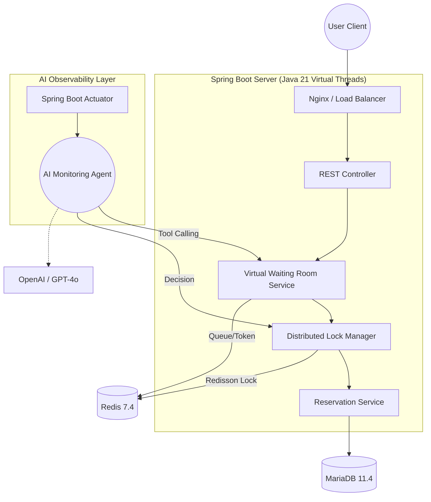
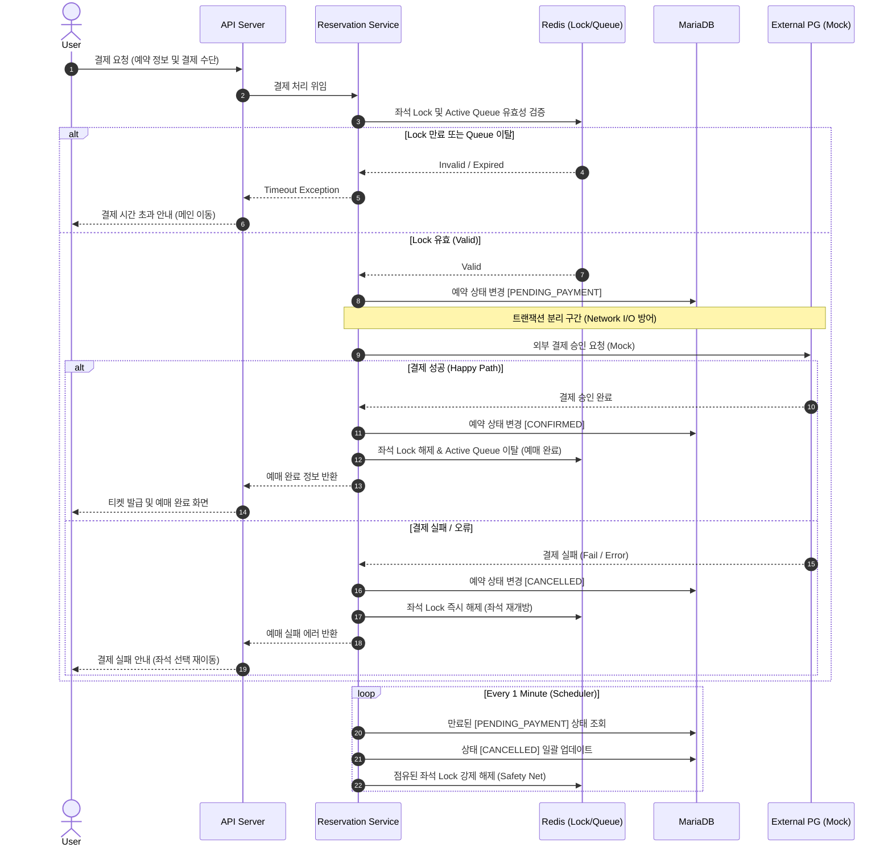

# 🎫 T-CORE v2
> **AI-Managed High-Traffic Ticketing Engine**
> 자율 운영 AI 에이전트를 결합한 고성능·고가용성 티켓팅 시스템

---

## 🚀 Project Vision
**"단순한 기능 구현을 넘어, 엔지니어링으로 대규모 트래픽의 한계를 극복합니다."**

T-CORE는 인기 콘서트 예매 시 발생하는 급격한 트래픽 폭주(Traffic Spike) 상황에서도 시스템의 안정성을 유지하고, 데이터 정합성을 100% 보장하는 것을 목표로 합니다. 특히, 현대적인 **AIOps** 개념을 도입하여 AI 에이전트가 실시간으로 시스템을 모니터링하고 장애에 자율적으로 대응하는 차세대 백엔드 아키텍처를 지향합니다.

---

## 🛠 Tech Stack & Decision Rationale

본 프로젝트는 단순한 기술의 유행을 따르는 것이 아니라, **성능(Performance), 확장성(Scalability), 운영 효율성(Efficiency)**이라는 엔지니어링 원칙에 따라 최적의 기술 스택을 선정했습니다.

### 1. Core Engine: Java 21 (LTS) & Spring Boot 3.5.10
* **Java 21 (LTS):** 고성능 티켓팅 시스템의 핵심인 **Virtual Threads**를 안정적으로 지원하는 최적의 LTS 버전입니다. 수만 개의 경량 스레드를 통해 차단(Blocking) I/O 상황에서도 리소스 효율을 극대화하며, **Scoped Values**를 통해 스레드 간 데이터를 안전하게 공유합니다.
* **Spring Boot 3.5.10:** 최신 안정 런타임으로 **Jakarta EE 11** 표준 지향 및 차세대 성능 최적화가 적용되었습니다. 프레임워크 차원의 가상 스레드 최적화를 통해 티켓팅과 같은 트래픽 Spike 상황에서 최소한의 오버헤드로 최대의 처리량을 이끌어냅니다.

### 2. Intelligent Ops: Spring AI 1.0.0-M5 (Agentic Framework)
* **Spring AI (Milestone 5):** Spring Boot 환경에서 외부 라이브러리(LangChain4j 등) 의존성을 최소화하고 자바 네이티브한 AI 개발을 가능케 합니다.
* **선정 이유:** **Spring Actuator**가 수집하는 실시간 메트릭(CPU, 대기열 상태 등)을 AI 에이전트가 직접 관찰(Observability)하고 제어할 수 있는 표준 인터페이스를 제공하기 때문입니다. 이를 통해 트래픽 폭주 시 스스로 대기열 진입 속도를 조절하는 **자율 운영(AIOps)** 환경을 구축했습니다.

### 3. Storage & Concurrency: Redis 7.4 & MariaDB 11.4 (LTS)
* **Redis 7.4 (Redisson 3.42+):** 초과 예약(Overselling) 방지와 가상 대기열 구현을 위해 선정했습니다. **Redisson**의 Pub/Sub 기반 분산 락(Distributed Lock)을 활용하여 스핀 락(Spin Lock) 없는 효율적인 동시성 제어를 보장합니다.
* **MariaDB 11.4 (LTS):** 11.x 시리즈의 장기 지원 버전으로, 대규모 트랜잭션 안정성이 검증되었습니다. 특히 향후 에이전트의 예매 패턴 분석 및 추천에 필요한 **벡터 검색(Vector Search)** 기능을 내장하고 있어 데이터 계층의 미래 확장성을 확보했습니다.

---

### 📊 Technology Stack Summary

| 분류 | 기술 | 버전 | 핵심 역할 |
| :--- | :--- | :--- | :--- |
| **Language** | Java | **21 (LTS)** | 고성능 가상 스레드 및 데이터 안정성 |
| **Framework** | Spring Boot | **3.5.10** | 시스템 엔진 및 최신 런타임 최적화 |
| **AI Agent** | Spring AI | **1.0.0-M5** | 자율 시스템 모니터링 및 자동 제어 |
| **Lock/Cache** | Redis | **7.4** | 분산 락 및 가상 대기열(ZSET) 관리 |
| **Database** | MariaDB | **11.4 (LTS)** | 영속성 데이터 관리 및 벡터 데이터 지원 |

---
## 🎫 Phase 5: High-Reliability Payment & Self-Healing Logic

대규모 트래픽 환경에서 결제 정합성을 보장하고 시스템 가용성을 유지하기 위한 핵심 비즈니스 로직 설계입니다. 단순히 기능을 구현하는 것을 넘어, **분산 환경에서 발생할 수 있는 장애 지점을 예측하고 공학적으로 방어**하는 데 집중했습니다.

### 1. 설계의 핵심 목표 (Core Objectives)
* **장애 전파 차단:** 외부 API(PG사) 지연이 시스템 전체의 DB 커넥션 고갈로 이어지는 것을 방지
* **데이터 정합성 보장:** 별도의 무거운 락 없이도 초과 예약(Overselling)을 100% 차단
* **시스템 자가 치유:** 유저 이탈이나 서버 장애로 인해 멈춘 고아 데이터를 자동으로 복구

---

### 2. 핵심 엔지니어링 포인트 (Engineering Highlights)

#### 🛡️ STEP 1: 결제 진입 및 트랜잭션 분리 (PaymentFacade)
외부 통신(Network I/O) 구간을 DB 트랜잭션 범위 밖으로 분리하여 **HikariCP 커넥션 점유 시간을 최소화**했습니다. PG사 응답이 지연되어도 다른 유저의 서비스 이용에 영향을 주지 않습니다.

```java
// PaymentFacade.java (Pseudo Code)
public void executePayment(...) {
    // 1. 대기열 활성 상태 검증 (Active Queue Check)
    waitingRoomService.validateActiveUser(userId);

    // 2. 예약 상태 확인 (Short-lived Read Transaction)
    paymentService.getPendingReservation(reservationId);

    // 3. 외부 PG사 결제 요청 (DB 커넥션 미점유 구간 - 장애 전파 차단)
    boolean success = mockPgClient.processPayment(amount);

    // 4. 결과 반영 (CAS 기반 원자적 상태 변경)
    if (success) {
        paymentService.confirmPayment(reservationId);
    } else {
        paymentService.cancelPayment(reservationId);
    }

    // 5. [Finally] 대기열 즉시 이탈 (시스템 회전율 극대화)
    waitingRoomService.removeActiveUser(userId);
}
```
#### 🛡️ STEP 2: CAS(Compare-And-Swap) 기반 정합성 보장
스케줄러와 결제 프로세스가 동시에 동일 예약건을 수정하려 할 때, **DB 레벨의 원자적 업데이트**를 통해 데이터 꼬임을 방지합니다. 별도의 무거운 비관적 락(Pessimistic Lock) 없이도 정합성을 유지하는 최적의 방식을 채택했습니다.

```java
// ReservationRepository.java
@Modifying
@Query("UPDATE Reservation r SET r.status = :newStatus " +
        "WHERE r.id = :id AND r.status = :expectedStatus") // ⭐️ 핵심: 내가 확인한 상태가 유지될 때만 업데이트
int updateStatusWithCAS(@Param("id") Long id,
                        @Param("newStatus") ReservationStatus newStatus,
                        @Param("expectedStatus") ReservationStatus expectedStatus);
```
* **동시성 방어 시나리오**: 
1. 결제 프로세스가 PENDING 상태를 확인하고 결제를 완료함
2. 그 사이 스케줄러가 타임아웃으로 상태를 CANCELLED로 변경 시도
3. 결제 프로세스가 뒤늦게 CONFIRMED로 바꾸려 하지만, WHERE status = 'PENDING' 조건이 맞지 않아 업데이트 행 수 0 반환
4. 시스템은 이를 인지하고 안전하게 사용자 환불(보상 트랜잭션) 절차 수행
#### 🛡️ STEP 3: Safety Net (자가 치유 스케줄러)
결제 도중 유저가 이탈하여 '결제 대기' 상태로 멈춘 좌석을 주기적으로 탐색하여 재개방합니다.
* **분산 락 적용**: Redisson을 활용해 여러 대의 서버 중 단 한 대만 스케줄러를 실행하도록 제어
* **성능 최적화**: JOIN FETCH와 복합 인덱스($O(\log N)$)를 활용하여 N+1 문제 해결 및 검색 속도 극대화
* 
### 3. 기술적 기대 효과 (Engineering Impact)
| 구분 | 도입 기술 | 해결된 문제 (Pain Point) | 비즈니스 가치 |
| :--- | :--- | :--- | :--- |
| **가용성** | **Transaction Segregation** | 외부 PG사 지연 시 DB 커넥션 고갈(Connection Pool Exhaustion) 방지 | 결제 지연 중에도 서비스 전체 마비 방지 및 안정적 운영 가능 |
| **정합성** | **CAS Pattern** | 분산 환경에서의 데이터 Race Condition 및 중복 수정 문제 | 초과 예매(Overselling) 사고 0% 달성 및 데이터 신뢰도 확보 |
| **효율성** | **Active Queue Removal** | 한정된 입장 슬롯(Active Queue)의 점유 시간 낭비 | 대기열 회전율 최적화 및 신규 유저 입장 속도 비약적 향상 |
| **안정성** | **Safety Net Scheduler** | 유저 이탈, 네트워크 장애 시 발생하는 유령 좌석(Ghost Seats) | 장애 상황에서도 5분 이내 좌석 가용 상태 자동 복구(Self-Healing) |
---
## 🏗 System Architecture

```mermaid
graph TD
    %% 사용자 및 로드밸런서
    User((User Client)) --> LB[Nginx / Load Balancer]
    
    %% 서버 및 로직
    subgraph "Spring Boot Server (Java 21 Virtual Threads)"
        LB --> API[REST Controller]
        API --> VWR[Virtual Waiting Room Service]
        VWR --> DL[Distributed Lock Manager]
        DL --> RS[Reservation Service]
    end

    %% AI 레이어
    subgraph "AI Observability Layer"
        Agent((AI Monitoring Agent))
        Actuator[Spring Boot Actuator] --> Agent
        Agent -- "Tool Calling" --> VWR
        Agent -- "Decision" --> DL
    end

    %% 데이터 저장소
    RS --> MariaDB[(MariaDB 11.4)]
    VWR -- "Queue/Token" --> Redis
    DL -- "Redisson Lock" --> Redis[(Redis 7.4)]
    
    %% AI 외부 연결
    Agent -.-> LLM[OpenAI / GPT-4o]
```
### 💳 Phase 5: Payment & Reservation Flow (결제 및 예매 확정 아키텍처)

티켓팅 시스템의 가장 중요한 구간인 결제 및 예매 확정 단계의 비즈니스 흐름입니다. 외부 PG사 연동 시 발생할 수 있는 네트워크 지연 및 타임아웃 상황에서도 **데이터 정합성**을 보장하고, **안전한 좌석 재개방(보상 트랜잭션)**이 이루어지도록 설계했습니다.


```mermaid
sequenceDiagram
    autonumber
    actor User
    participant API as API Server
    participant RS as Reservation Service
    participant Redis as Redis (Lock/Queue)
    participant DB as MariaDB
    participant PG as External PG (Mock)

    User->>API: 결제 요청 (예약 정보 및 결제 수단)
    API->>RS: 결제 처리 위임
    RS->>Redis: 좌석 Lock 및 Active Queue 유효성 검증
    
    alt Lock 만료 또는 Queue 이탈
        Redis-->>RS: Invalid / Expired
        RS-->>API: Timeout Exception
        API-->>User: 결제 시간 초과 안내 (메인 이동)
    else Lock 유효 (Valid)
        Redis-->>RS: Valid
        RS->>DB: 예약 상태 변경 [PENDING_PAYMENT]
        
        Note over RS, PG: 트랜잭션 분리 구간 (Network I/O 방어)
        RS->>PG: 외부 결제 승인 요청 (Mock)
        
        alt 결제 성공 (Happy Path)
            PG-->>RS: 결제 승인 완료
            RS->>DB: 예약 상태 변경 [CONFIRMED]
            RS->>Redis: 좌석 Lock 해제 & Active Queue 이탈 (예매 완료)
            RS-->>API: 예매 완료 정보 반환
            API-->>User: 티켓 발급 및 예매 완료 화면
        else 결제 실패 / 오류
            PG-->>RS: 결제 실패 (Fail / Error)
            RS->>DB: 예약 상태 변경 [CANCELLED]
            RS->>Redis: 좌석 Lock 즉시 해제 (좌석 재개방)
            RS-->>API: 예매 실패 에러 반환
            API-->>User: 결제 실패 안내 (좌석 선택 재이동)
        end
    end

    %% Safety Net (보상 트랜잭션)
    loop Every 1 Minute (Scheduler)
        RS->>DB: 만료된 [PENDING_PAYMENT] 상태 조회
        RS->>DB: 상태 [CANCELLED] 일괄 업데이트
        RS->>Redis: 점유된 좌석 Lock 강제 해제 (Safety Net)
    end
```
#### 💡 Key Engineering Points in Phase 5
1. **상태 기반 결제 대기 (PENDING_PAYMENT):** 외부 API 연동 중 서버 장애가 발생하더라도 결제 상태를 추적할 수 있도록 임시 상태를 도입했습니다.
2. **트랜잭션 분리 (Transaction Segregation):** 외부 PG사 호출(Network I/O) 구간을 DB 트랜잭션(`@Transactional`)에서 분리하여, 결제 지연으로 인한 DB 커넥션 풀 고갈(Connection Pool Exhaustion)을 방지합니다.
3. **Safety Net 스케줄러 (보상 트랜잭션):** 브라우저 종료, 네트워크 단절 등으로 결제 상태가 고착화된 경우, 백그라운드 스케줄러가 주기적으로 만료된 예약을 찾아 취소 처리하고 Redis 락을 강제로 해제하여 좌석을 안전하게 대기열로 재개방합니다.
---
## 📂 Directory Structure

본 프로젝트는 유지보수성과 확장성을 극대화하기 위해 **계층형 아키텍처(Layered Architecture)**를 채택하였으며, 각 레이어의 책임을 명확히 분리했습니다.

```text
src/main/java/com/tcore/tcorev2/
├── api/                # [Interface Layer] 외부 요청(HTTP/REST) 진입점
│   ├── controller/     # API 엔드포인트 정의
│   └── dto/            # 데이터 전송 객체 (Request/Response 분리)
├── application/        # [Application Layer] 비즈니스 로직 조립 및 트랜잭션 관리
│   └── service/        # 비즈니스 흐름 제어 (Use Case 구현)
├── domain/             # [Domain Layer] 핵심 비즈니스 규칙 및 도메인 모델 (Pure Logic)
│   ├── entity/         # JPA 엔티티 (핵심 데이터 모델)
│   ├── repository/     # 데이터 접근 인터페이스
│   └── model/          # 도메인 전용 Enum 및 상수
├── infrastructure/     # [Infrastructure Layer] 외부 기술 및 라이브러리 연동
│   ├── ai/             # Spring AI 기반 자율 운영 에이전트 구현체
│   ├── redis/          # Redisson 분산 락 및 대기열(ZSET) 설정
│   └── config/         # DB, Security 등 전역 설정
└── global/             # [Global] 프로젝트 전역 공통 모듈
    ├── error/          # 공통 예외 처리 (GlobalExceptionHandler)
    ├── util/           # 공통 유틸리티 클래스
    └── common/         # 공통 Response 형식 및 상수
```
---
## 💡 Key Engineering Challenges
### 1. 분산 환경에서의 레이스 컨디션 해결
* 다중 서버 환경에서 발생하는 좌석 선점 문제를 해결하기 위해 **Redis 분산 락**을 도입하여 1,000 TPS 이상의 환경에서도 데이터 오차율 0%를 달성하고자 했습니다.

### 2. 가상 대기열을 이용한 DB 부하 분산
* 모든 요청이 직접 DB로 인입되지 않도록 **Redis Sorted Set** 기반의 가상 대기열(Virtual Waiting Room)을 구축하여, 시스템 가용 범위 내에서만 트래픽을 순차적으로 처리합니다.

### 3. AI 기반 자율 장애 대응 (Self-Healing)
* 정적 임계치 기반의 모니터링 한계를 극복하기 위해 AI 에이전트를 도입했습니다. 에이전트는 실시간 지표를 분석하여 비정상 패턴을 감지하면 즉시 **Rate Limiting** 수치를 조정하거나 이상 IP를 차단하는 도구를 스스로 실행합니다.

---
## 🗺️ Project Roadmap

티켓팅 시스템의 핵심 기능을 단계별로 구현하며, 각 단계마다 성능 최적화와 정합성 검증을 병행합니다.

### ✅ Phase 1: Infrastructure & Domain Modeling (Completed)
- [x] 기술 스택 선정 및 프로젝트 환경 설정 (Java 21, Spring Boot 3.5.10)
- [x] 핵심 도메인 모델링 (Concert, Schedule, Seat, Reservation)
- [x] Docker 기반 MariaDB 및 Redis 인프라 구축

### 🔄 Phase 2: Concert Information API (Completed)
- [x] 전체 공연 목록 조회 API 구현
- [x] 특정 공연의 상세 일정 및 실시간 잔여 좌석 조회 구현
- [x] 레이어드 아키텍처 리팩토링 및 테스트 코드(MockMvc, Mockito) 작성
- [x] 개발 브랜치(`feature/concert-search`) PR 및 `develop` 병합

### 📅 Phase 3: Distributed Lock Reservation (Completed)
- [x] Redisson 기반 분산 락(Distributed Lock) 환경 설정
- [x] 좌석 선택 및 임시 예약 로직 구현 (초과 예약 방지)
- [x] 동시성 테스트를 통한 데이터 정합성 검증

### 🚀 Phase 4: Virtual Waiting Queue & AI Ops (Completed)
- [x] Redis ZSet 기반의 가상 대기열(Waiting Queue) 시스템 구축
- [x] Spring AI를 활용한 실시간 트래픽 모니터링 및 대기열 자동 제어
- [x] 트래픽 Spike 상황에서의 시스템 부하 테스트 (Mock 시뮬레이션 검증)

### 💳 Phase 5: Payment & Final Confirmation (Completed)
- [x] 결제 연동 시뮬레이션 및 예매 확정 처리 (Facade 패턴을 통한 트랜잭션 분리)
- [x] 예매 취소 및 좌석 재개방 로직 구현 (CAS 패턴 및 Safety Net 스케줄러)
- [x] 전체 비즈니스 흐름 최종 통합 테스트 (동시성 및 Race Condition 검증)

### 🚀 Phase 6: Intelligent Ops & Monitoring (Planned)
- [ ] Spring AI 기반 시스템 메트릭 관찰(Observability) 및 분석 에이전트 구축
- [ ] 실시간 트래픽 패턴 분석을 통한 이상 징후 탐지 로직 구현
- [ ] AI 도구 호출(Tool Calling)을 활용한 동적 Rate Limiting 및 유입량 자동 제어
- [ ] 최종 시스템 부하 테스트(nGrinder/k6) 및 성능 최적화 리포트 작성
